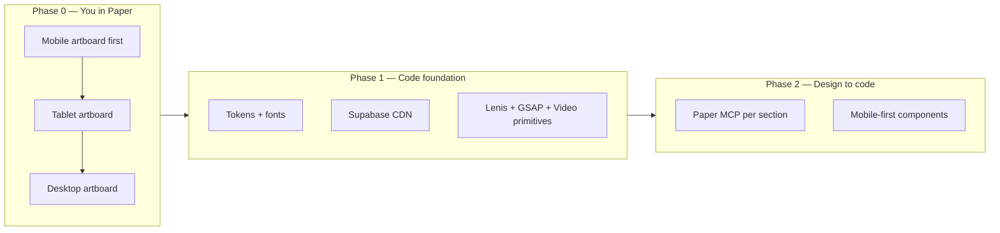

# Yess Chef landing page polish (revised)

> Copy of the Cursor plan for this project. Canonical copy in repo: `docs/plan.md`.  
> When resuming work: **@docs/plan.md** and say “continue from the implementation order.”

## Scope change

You are **redesigning the page in Paper** (custom fonts, more images and illustrations) and need **mobile-first responsive** behavior end-to-end. The polish work (Lenis, GSAP, videos, tokens, Supabase) should support that redesign—not lock in the current 3-section layout.

**Two-phase delivery:**

Phase 1 can start in parallel once the **mobile** artboard has stable typography and colors; full section markup should wait until mobile (at minimum) is designed.

---

## How to do mobile-first responsive in Paper

Paper does **not** auto-generate breakpoints like Figma variants. The standard workflow is **one artboard per breakpoint**, designed in order **mobile → tablet → desktop**.

### 1. Create three artboards (Paper defaults)

| Artboard | Size | Notes |
|----------|------|--------|
| **Mobile** | **390 × 844px** | Design this **first**. Add status bar via `get_guide({ topic: "mobile-status-bar" })` if you want realistic safe area. |
| **Tablet** | **768 × 1024px** | Adapt layout from mobile (wider columns, side-by-side where needed). |
| **Desktop** | **1440 × 900px** | Full layout; more horizontal space for nav, grids, illustrations. |

Use `create_artboard` with these sizes, or create manually in Paper Desktop. Leave **~80px gap** between artboards on the canvas.

### 2. Naming convention (critical for Cursor)

Use **matching layer names** across all three artboards so design-to-code maps cleanly:

- Artboards: `Home — Mobile`, `Home — Tablet`, `Home — Desktop`
- Sections: `hero-section`, `features-section`, `booking-section`, etc.
- Reusable groups: `top-nav`, `cta-primary`

When you ask Cursor to implement a section, **select that section on the Mobile artboard** first.

### 3. Mobile-first design habits in Paper

- **Stack by default** on mobile: single column, full-width images, CTAs full-width or stacked.
- **Define the type scale on mobile** (display, title, body, label)—then adjust sizes on tablet/desktop only where needed.
- **Custom fonts:** Call `get_font_family_info` (via Cursor + Paper MCP) before first use to confirm the family and weights exist.
- **Artboard height:** When content is done, set artboard `height: "fit-content"` via `update_styles`.
- **Review:** `get_screenshot` per artboard after each major section.

### 4. Tablet / desktop adaptation

- **Duplicate and adapt** with `duplicate_nodes`, then `update_styles` / `set_text_content`.
- Document layout differences so code uses `md:` / `xl:` that match the design.

### 5. Paper → code breakpoint map

| Paper artboard | Tailwind | Min width |
|----------------|----------|-----------|
| Mobile (390) | default (no prefix) | — |
| Tablet (768) | `md:` | 768px |
| Desktop (1440) | `xl:` or `lg:` + `xl:` | 1024px / 1280px |

Pull **`get_computed_styles` from the Mobile artboard** for base styles; tablet/desktop for overrides only where layout diverges.

### 6. Cursor prompt pattern (after redesign)

> Design-to-code: Mobile artboard, selected `hero-section`. `get_tree_summary` → `get_jsx` (tailwind) → export images to Supabase. Implement responsive `Hero.tsx` (mobile-first). Use `get_computed_styles` from Mobile for base; compare Tablet/Desktop artboards for `md:`/`xl:` only where layout changes.

---

## Redesign: fonts, images, illustrations

### Custom fonts (code)

- Identify families/weights from Paper `get_basic_info` / `get_font_family_info`.
- Load with **`next/font/google`** or **`next/font/local`** in `app/layout.tsx`.
- Wire CSS variables in `app/globals.css` `@theme` (`--font-display`, `--font-body`).

### Images & illustrations (Supabase)

- **Public bucket** `yess-chef-assets`: `images/`, `illustrations/`, `videos/`, `fonts/` (if self-hosting).
- `lib/assets.ts`: manifest of every URL.
- Do not commit large binaries to git after migration.

---

## 1. Supabase Storage

Public bucket = anyone can **read** via URL; you **upload** via Dashboard/CLI.

- Env: `NEXT_PUBLIC_SUPABASE_URL`, `NEXT_PUBLIC_ASSETS_BUCKET`
- `next.config.ts`: `images.remotePatterns` for `*.supabase.co`
- No Supabase JS client required for read-only marketing assets

---

## 2. Lenis smooth scroll

- `components/providers/LenisProvider.tsx` in layout
- Remove `scroll-behavior: smooth` from CSS when Lenis is active
- `prefers-reduced-motion`: disable Lenis

---

## 3. Background videos (placeholders)

- `components/ui/BackgroundVideo.tsx`: `src`, `poster`, scrim
- Placeholder MP4s in Supabase `videos/`; swap files later, same paths

---

## 4. GSAP stagger text

- `components/ui/StaggerText.tsx` with ScrollTrigger + Lenis sync
- `prefers-reduced-motion` bypass

---

## 5. Standardize buttons, typography, colors

- `@theme` from **Mobile artboard** via `get_computed_styles`
- `text-display`, `text-title`, `text-body`, `text-label`; Button `primary` / `ghost`

---

## 6. Responsive layout (code, mobile-first)

- Container padding aligned to Paper margins
- `next/image` `sizes` tuned mobile-first
- Verify at **390, 768, 1024, 1440** vs Paper screenshots

---

## 7. Verification checklist

- Three Paper artboards reviewed via screenshot
- `npm run build` with Supabase env vars
- All media from Supabase URLs
- Lenis + GSAP + reduced motion
- Lighthouse on mobile viewport

---

## Implementation order

1. **You:** Mobile artboard redesign in Paper (fonts, sections, assets named).
2. **You:** Tablet + Desktop artboards (duplicate/adapt, consistent names).
3. **Code:** Tokens + `next/font` + Supabase bucket + `lib/assets.ts`.
4. **Code:** Motion primitives (Lenis, StaggerText, BackgroundVideo).
5. **Code:** Design-to-code one section at a time from Mobile selection.
6. **Code:** Full-page QA vs Paper; README asset workflow.

**Defer** rewriting current `Hero` / `BookingSection` until the new mobile artboard exists.

---

## Checklist (from plan todos)

- [ ] Paper: Mobile artboard (390×844)
- [ ] Paper: Tablet + Desktop artboards
- [ ] Code: Design tokens + fonts
- [ ] Code: Supabase assets + `lib/assets.ts`
- [ ] Code: Lenis, GSAP, BackgroundVideo
- [ ] Code: Design-to-code per section
- [ ] Code: Cleanup + docs
